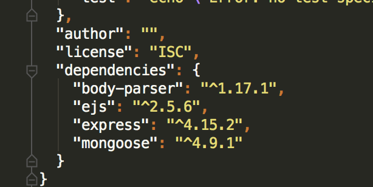
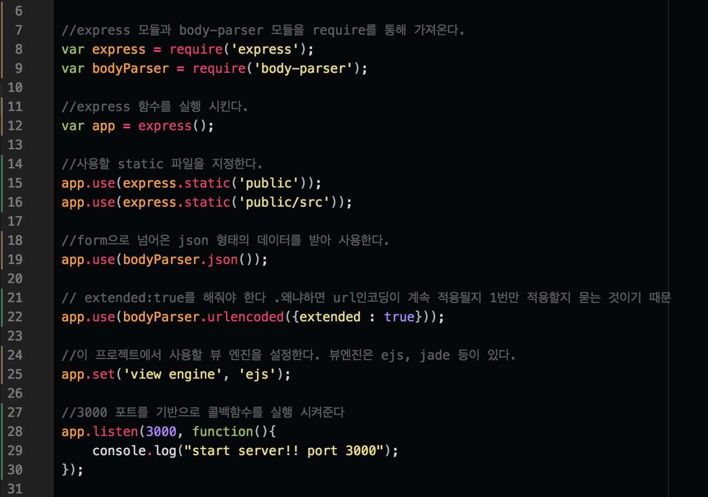
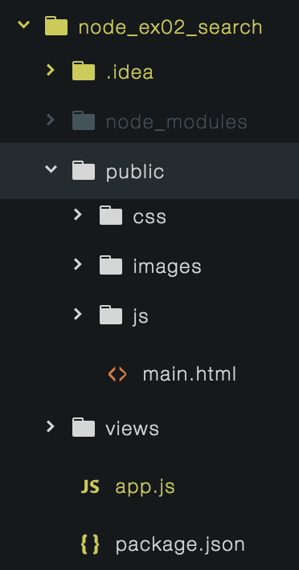

## nodejs

#### node 기초

- package.json을 사용하면 용량이 큰 npm 폴더를 github에 업로드 하지 않고도 클론시 npm을 설치하여 바로 사용 할수 있다. 일종의 config 파일이다.
- npm install express `--save` 시 package 파일에 의존 되어 어디서든지 사용가능하다

- require은 nodemodules 폴더에 있는 node package 들을 가져와 사용 할수 있도록 해준다
- 노드 js는 비동기로 동작 하기 때문에 콜백 함수는 가장 늦게 실행된다.
- dist 폴더에는 서비스 배포시 공백등 필요없는 파일을 줄여서 배포하는 min.js같은 파일을 넣을 수 있다.

  > gulf, grunt, webpack등 , 프로젝트의 모든 js 파일을 합치고 공백과 같은 내용을 모두 없앤후 bundle파일이다.
  > 결국 dist파일이 최종적으로 배포 되는 것다

- dom 조작을 방해 하지 않기 위해 스크립트파일은 모두 밑에 정의 한다
- 다양한 테스트 코드를 test 폴더 안에 작성한다.
- 위와 같은 폴더 구조를 만들수 있다.

#### node 프로젝트 생성순서

1. npm init 명령어를 통해 package.json 파일을 생성
2. `npm install --save [modules]` 명령어를 통해 필요한 모듈을 package.json에 dependencies를 추가 한다.
 > ex) npm install --save body-parser ejs express mongoose ...

 > 

3. app.js 파일을 생성
 - app.js의 기본 구성
> 

#### url 라우팅

- url은 http메소드 중 get으로 요청한다
- res.sendFile메소드를 통해 html 파일을 클라이언트에게 보내줄 수 있다

- get
> get이란?
> 데이터를 가져오는 역할을 하는 메소드 
> 서버에서도 비동기로 해당 경로로 들어오길 기다리고 있다.
~~~
    app.get('/main',(req,res)=>{
        res.sendFile(__dirname + "/public/src/html/service.html");
    });
~~~

- post
> post란?
> http method 이다. post는 url에 정보가 담기는 것이 아니다. 중요한 데이터를 보낼때에는 post로 보내는 것이 정상 적이다. 
> post는 데이터를 보낼때 사용하는 메소드, 데이터를 저장하는 메소드 
> 보통 form 태그와 submit을 통해 데이터를 보낼 수 있다.
~~~
  app.post('/email_post',(req,res)=>{
      console.log(req.body);
      let body = req.body;
      res.render('email.ejs', {'email' : body.emailId});
  });
~~~

- body-parser
> post의 데이터를 받을수 있도록 만드는 모듈, post는 정보를 body안에 넣어 오기 때문에 body안의 정보를 body-parser을 통해 바꾸어준다. 
> app.use(bodyParser.urlencoded({extended : true})); 을 통해 url인코딩을 계속 적용 할수 있다. 
> req.body는 input 태그의 name 과 val값을 {}객체 형태로 받아온다

- view engine
> node.js의 view engine을 통해 클라이언트로 응답을 보낼 때 적절한 데이터를 넣어서 보내줄수 있다. 
> view template는 여러개 있다 기본으로 jade, ejs등이 있다. 
> npm install ejs --save를 통해 설치 후 `app.set('view engine', 'ejs');` 을 셋팅 해준다 
> `res.render('email.ejs', {'email' : body.emailId});` 와 같이 render 함수를 통해서 서버로 부터 데이터를 받아 views/email.ejs파일에 렌더링 해준다.

- static 디렉토리 추가
> url로 접근해서 브라우저에 내려 받을수 있는 정적파일의 위치를 등록한다. 
> `app.use(express.static('public'))`을 통해 public 아래에 있는 js,css,images폴더의 정적파일을 받아 렌더링 하게 해준다. 
> app.use(express.static('public')); 을 사용하여 public폴더 안에 있는 모든 static 파일을 서버에서 내려보내지도록 처리한다. 
> node 에서는 js, css 등과 같은 파일을 static 파일이라고 한다. 변경이 되지 않는 정적인 파일이다. 서버에서 요청 받는데로 바로 처리하면 좋다.  
> 

- ajax

- node.js 라우팅 처리
> 여러가지 라우팅 처리를 다른 파일로 모듈화 하여 관리하면 좋다
  1. router 폴더를 만든다.
  2. routing 원하는 파일을 만든후 express의 Router() 메소드를 통하여 router를 만든다.
  3. app을 통해서 수행 했던 routing 처리를 router를 통해 처리 한다.
  4. router 객체를 외부에서 사용 할 수 있도록 exprort해준다.
  5. app.js 에서 라우팅 할 파일을 require 해준다.
  6. `app.use()`를 통해 routing 할 router 파일을 경로와 함께 등록한다.

  - main.js

<table class="colorscripter-code-table" style="margin:0; padding:0; border:none; background-color:#272727; border-radius:4px;" cellspacing="0" cellpadding="0"><tr><td style="padding:6px; border-right:2px solid #4f4f4f">

1

2

3

4

5

6

7

8

9

10

11

12

13

14

15

16

17

18

</td><td style="padding:6px 0">

/*&nbsp;

./router/main.js&nbsp;

"/main"&nbsp;경로로&nbsp;들어오는&nbsp;routing&nbsp;

*/

&nbsp;

var&nbsp;express&nbsp;=&nbsp;require("express");

var&nbsp;app&nbsp;=&nbsp;express();

&nbsp;

//express&nbsp;하단의&nbsp;Router&nbsp;라는&nbsp;메소드를&nbsp;실핸&nbsp;시킨다.

var&nbsp;router&nbsp;=&nbsp;express.Router();

&nbsp;

//&nbsp;이미&nbsp;app에서&nbsp;/main으로&nbsp;라우팅&nbsp;되어&nbsp;들어왔기&nbsp;때문에&nbsp;루트만&nbsp;써줘도&nbsp;"http://localhost:3000/main"&nbsp;으로&nbsp;처리된&nbsp;것이다.

router.get('/',(req,res)=&amp;gt;{

&nbsp;&nbsp;&nbsp;&nbsp;res.sendFile(__dirname&nbsp;+&nbsp;"/public/src/html/service.html");

});&nbsp;

&nbsp;

//외부에서도&nbsp;사용할수&nbsp;있도록&nbsp;router를&nbsp;export&nbsp;해준다.

module.exports&nbsp;=&nbsp;router;&nbsp;

<a href="http://colorscripter.com/info#e" target="_blank" style="color:#4f4f4f; text-decoration:none">Colored by Color Scripter</a>
</td><td style="vertical-align:bottom; padding:0 2px 4px 0"><a href="http://colorscripter.com/info#e" target="_blank" style="text-decoration:none; color:white">cs</a></td></tr></table>

 

  - app.js

<table class="colorscripter-code-table" style="margin:0; padding:0; border:none; background-color:#272727; border-radius:4px;" cellspacing="0" cellpadding="0"><tr><td style="padding:6px; border-right:2px solid #4f4f4f">

1

2

3

4

5

6

7

8

9

10

11

12

</td><td style="padding:6px 0">

//&nbsp;app.js

var&nbsp;express&nbsp;=&nbsp;require('express');

&nbsp;

var&nbsp;app&nbsp;=&nbsp;express();

&nbsp;

//main&nbsp;router&nbsp;모듈

var&nbsp;main&nbsp;=&nbsp;require("./router/main");

&nbsp;

//"/main"&nbsp;경로에&nbsp;대한&nbsp;routing&nbsp;처리를&nbsp;main&nbsp;모듈에&nbsp;위임.

app.use("/main",main);

&nbsp;

&nbsp;

<a href="http://colorscripter.com/info#e" target="_blank" style="color:#4f4f4f; text-decoration:none">Colored by Color Scripter</a>
</td><td style="vertical-align:bottom; padding:0 2px 4px 0"><a href="http://colorscripter.com/info#e" target="_blank" style="text-decoration:none; color:white">cs</a></td></tr></table>

