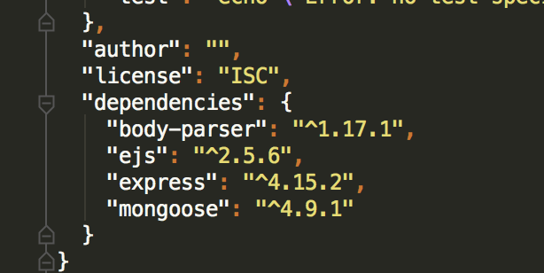
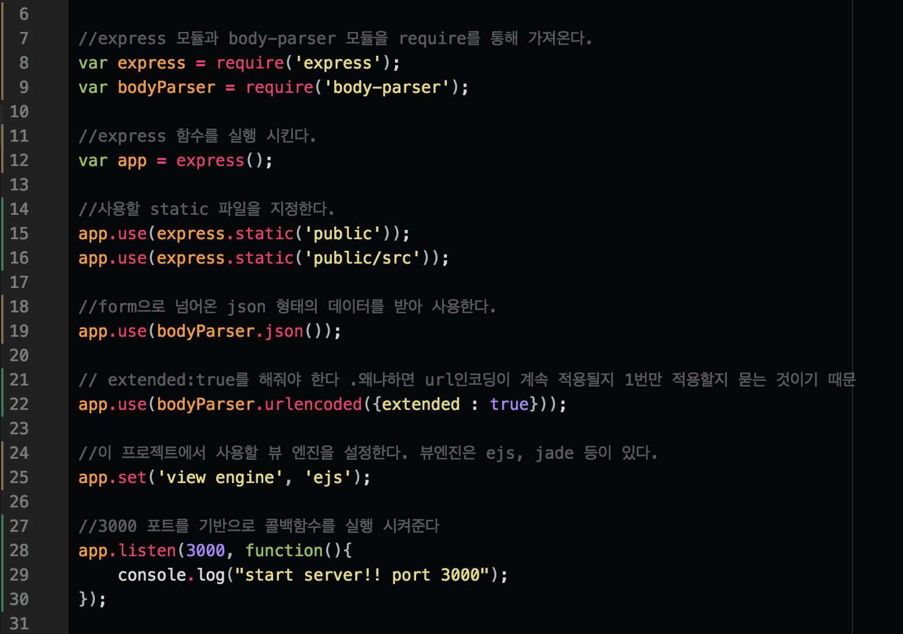

#### node 기초

- package.json을 사용하면 용량이 큰 npm 폴더를 github에 업로드 하지 않고도 클론시 npm을 설치하여 바로 사용 할수 있다. 일종의 config 파일이다.
- npm install express `--save` 시 package 파일에 의존 되어 어디서든지 사용가능하다

- require은 nodemodules 폴더에 있는 node package 들을 가져와 사용 할수 있도록 해준다
- 노드 js는 비동기로 동작 하기 때문에 콜백 함수는 가장 늦게 실행된다.
- dist 폴더에는 서비스 배포시 공백등 필요없는 파일을 줄여서 배포하는 min.js같은 파일을 넣을 수 있다.

  > gulf, grunt, webpack등 , 프로젝트의 모든 js 파일을 합치고 공백과 같은 내용을 모두 없앤후 bundle파일이다.
  > 결국 dist파일이 최종적으로 배포 되는 것다

- dom 조작을 방해 하지 않기 위해 스크립트파일은 모두 밑에 정의 한다
- 다양한 테스트 코드를 test 폴더 안에 작성한다.
- 위와 같은 폴더 구조를 만들수 있다.

#### node 프로젝트 생성순서

1. npm init 명령어를 통해 package.json 파일을 생성
2. `npm install --save [modules]` 명령어를 통해 필요한 모듈을 package.json에 dependencies를 추가 한다.
 > ex) npm install --save body-parser ejs express mongoose ...

 > 

3. app.js 파일을 생성
 - app.js의 기본 구성
> 
