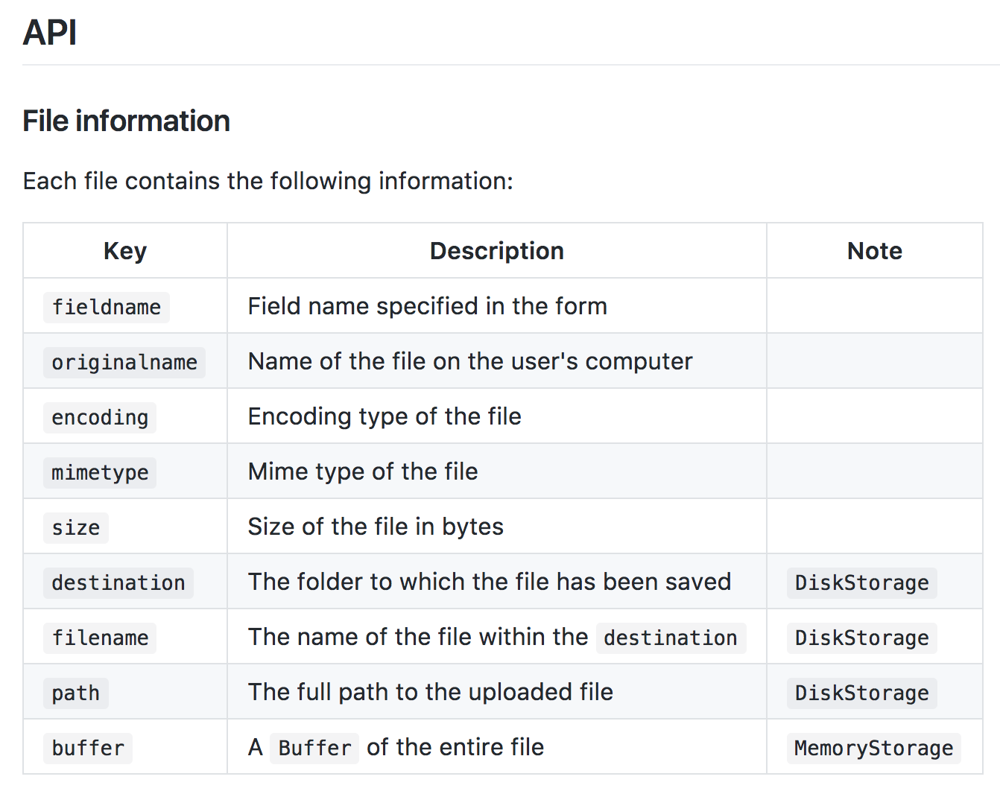

## 파일 업로드 

#### 1. multer 모듈 설치
- `npm install multer --save`
- https://github.com/expressjs/multer

#### 2. 파일을 전송 하기 위한 수단 - form 만들기
- 파일을 보내기위한 MIME 인 `enctype="multipart/form-data"`을  추가.
- post 로 전송 해야한다.
- 사용자가 전송한 파일을 서버에 전달 하기 위해  multer 모듈을 사용한다.
- 아래 예제와 같이 form을 만든다.
~~~html
//html 파일
<form action="upload" method="post" enctype="multipart/form-data">
	<input type=file name="userFile"/>
	<input type="submit"/>
</form>
~~~

#### 3. multer 이용 방법
- `var upload = multer({ dest: 'uploads/' })` : multer 모듈을 함수인 것을 확인할수 있다. multer 함수에 `{ dest: 'uploads/' }`을 옵션을 주어 실행시키면 upload를 할수 있는 미들웨어를 반환한다.
- { dest: 'uploads/' }의 dest는 목적지이며 upload된 파일이 저장될 위치를 가리킨다.
- `uploads` 폴더를 만든다.

- `upload.single('userFile')` : app.post의 두번째 인자로 upload 미들웨어를 전달하면 콜백 함수를 실행하기전에 **미들웨어를 먼저 실행** 시킨다. 사용자가 전송한 데이터중 파일이 포함되어 있다면 request 객체에 파일이라는 프로퍼티를 암시적으로 추가하도록 하는 미들웨어이다. 이 후 콜백함수가 실행 되었을때 req 객체에 file이라는 프로퍼티를 사용 할수 있도록 만들어 준다.
- `single('userFile')` : single의 인자로는 file input 태그의 name을 명시 해주어야 한다.

- 아래는 전송된 파일을 정보를 console.log()를 통해 확인한 결과이다.
~~~Son
 { 
 //form의 name값
 fieldname: 'myfile',
 //파일의 실제 이름 
 originalname: '20160224_104138.jpg',
 
 encoding: '7bit',
 //전송한 파일의 타입
 mimetype: 'image/jpeg',
 //서버에 저장될 목적지
 destination: '/tmp/upload/',
 //임의이 이름으로 저장된다.
 filename: '8563e0bef6efcc4d709f2d1debb35777',
 //전송된 최종 경로
 path: '/tmp/upload/8563e0bef6efcc4d709f2d1debb35777',
 //파일의 사이즈
 size: 1268337 
 }
~~~

- multer useage
~~~javascript
var express = require('express')
var multer  = require('multer')
var upload = multer({ dest: 'uploads/' })

var app = express()

app.post('/profile', upload.single('avatar'), function (req, res, next) {
  // req.file is the `avatar` file
  // req.body will hold the text fields, if there were any
})

app.post('/photos/upload', upload.array('photos', 12), function (req, res, next) {
  // req.files is array of `photos` files
  // req.body will contain the text fields, if there were any
})

var cpUpload = upload.fields([{ name: 'avatar', maxCount: 1 }, { name: 'gallery', maxCount: 8 }])
app.post('/cool-profile', cpUpload, function (req, res, next) {
  // req.files is an object (String -> Array) where fieldname is the key, and the value is array of files
  //
  // e.g.
  //  req.files['avatar'][0] -> File
  //  req.files['gallery'] -> Array
  //
  // 
 })
~~~

#### 4. multer 심화
- file infomation 확인
> 
- 파일을 dest로 설정한 경로에 저장시 이름은 랜덤한 값으로 저장 된다. file information의 filename 확인.
- dest 보다 복잡한 처리를 하고 싶다면 key의 값을 storage로 변경 한다.
- multer의 diskStorage 메소드를 호출하면 storage객체를 리턴 할 것이다.
- upload 미들웨어가 실행 될 때 해당 storage 객체에 설정한 내용을 실행 할 것이라고 선언 한 것이다.
- destination,filename 메소드를 잘 정의 한다면 사용자에게 좀더 많은 자유도를 줄수 있을 것이다.
~~~javascript
var storage = multer.diskStorage({
  // destination 메소드 : 어디에 upload한 파일을 저장할 것인가?
  destination: function (req, file, cb) {
    //어디에 upload 파일을 저장 할 것인지 destination의 세번째 인자인 cb 함수의 두번째 인자로 경로를 전달해 주면 된다.
    if(file.mimetype === "text/txt"){
    	cb(null, '/uploads/text')
    }
    else{
       	cb(null, '/uploads/image')
    }
  },
  // filename 메소드 : destination에서 지정한 경로의 파일의 이름을 어떻게 저장할 것인가?
  filename: function (req, file, cb) {
    //파일의 이름을 설정할 때에는 filename 세번째 인자인 cb 함수의 두번째 인자로 원하는 이름을 만들어 전달해 주면 된다.
    cb(null, file.fieldname + '-' + Date.now())
  }
})
var upload = multer({ storage: storage })
~~~

- 사용자들에게 이미지를 사용하게 하고 싶다면 `app.use(express.static('public'));`을 사용하여 정적 파일을 접근 하도록 한다.
- `app.use("/user",express.static("uploads"));`을 작성하고 사용자는 `localhost:3000/user/1732.png` 와 같이 바로 접근이 가능하다.

#### 5. ajax를 통한 파일 업로드 example
- html
~~~html
<!DOCTYPE html>
<html lang="en">
<head>
    <meta charset="UTF-8">
    <title>Title</title>
</head>
<body>

    <!-- 파일 업로드 form -->
    <input type="email" id="input_email"/>
    <input type="file" id="input_file"/>
    <input type="button" id="submit_btn"/>

</body>
</html>
~~~
 
- javascript
~~~Javascript
(function(){  
  document.querySelector("#submit_btn").addEventListener("click",function(){
	let inputFile = document.querySelector("#input_file").files[0];
    let email = document.querySelector("#input_email").value;
  
    //FormData객체 생성
    var formData = new FormData();
    //FormData 에 파일과 이메일을 append 메소드를 통해 등록
    formData.append("inputFile", inputFile);
    formData.append("email", email);

    // ajax를 통해 서버로 FormData 전송
    runAjaxData(reqListener, "post", "localhost:3000/ex",formData);
   });         
  })();

    // 응답 객체 반환시 실행할 콜백함수
function reqListener(res){
	console.log(res);
}

    //ajax 실행 메소드
function runAjaxData (reqListener, method, url, data, contentType){
	var xhr = new XMLHttpRequest();
    xhr.open(method, url);
     if(contentType !== undefined){
         xhr.setRequestHeader("Content-Type",contentType);
     }
     xhr.send(data);
     xhr.addEventListener("load", reqListener);
}
~~~
 
- node.js
~~~Javascript
var multer = require("multer");
var storage = multer.diskStorage({
    destination: function (req, file, callback) {
        callback(null, 'public/images/uploads');
    },
    filename: function (req, file, callback) {
        callback(null, file.fieldname+ '-' + Date.now() + "." +file.mimetype.split("/")[1])
    }
});
var upload = multer({ storage: storage });

router.post("/insertBoard",upload.single('inputFile'),function(req,res){
        // 전송된 텍스트 데이터 확인
        let data = req.body;
        // 전송된 파일 데이터 확인
        let inputFileUrl = req.file.path;
});
~~~
