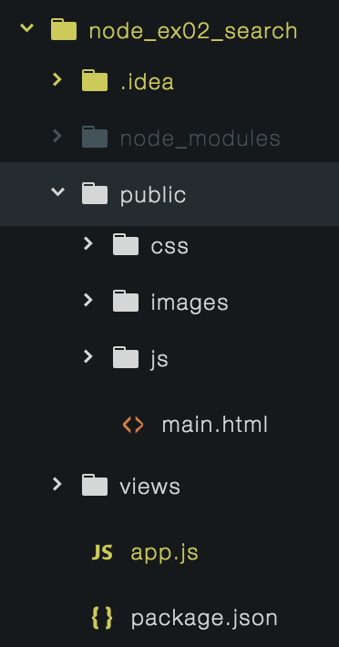

#### url 라우팅

- url은 http메소드 중 get으로 요청한다
- res.sendFile메소드를 통해 html 파일을 클라이언트에게 보내줄 수 있다

- get
  > get이란?
  > 데이터를 가져오는 역할을 하는 메소드 
  > 서버에서도 비동기로 해당 경로로 들어오길 기다리고 있다.
  ~~~
      app.get('/main',(req,res)=>{
          res.sendFile(__dirname + "/public/src/html/service.html");
      });
  ~~~

- post
  > post란?
  > http method 이다. post는 url에 정보가 담기는 것이 아니다. 중요한 데이터를 보낼때에는 post로 보내는 것이 정상 적이다. 
  > post는 데이터를 보낼때 사용하는 메소드, 데이터를 저장하는 메소드 
  > 보통 form 태그와 submit을 통해 데이터를 보낼 수 있다.
  ~~~
    app.post('/email_post',(req,res)=>{
        console.log(req.body);
        let body = req.body;
        res.render('email.ejs', {'email' : body.emailId});
    });
  ~~~

- body-parser
  > post의 데이터를 받을수 있도록 만드는 모듈, post는 정보를 body안에 넣어 오기 때문에 body안의 정보를 body-parser을 통해 바꾸어준다. 
  > `app.use(bodyParser.urlencoded({extended : true}));` 을 통해 url인코딩을 계속 적용 할수 있다. 
  > req.body는 input 태그의 name 과 val값을 {}객체 형태로 받아온다
  > body-parser를 통해 json을 해석한다. 
  > get으로는 json형태로 보내는데 무리가 있다. 

- view engine
  > node.js의 view engine을 통해 클라이언트로 응답을 보낼 때 적절한 데이터를 넣어서 보내줄수 있다. 
  > view template는 여러개 있다 기본으로 jade, ejs등이 있다. 
  > npm install ejs --save를 통해 설치 후 `app.set('view engine', 'ejs');` 을 셋팅 해준다 
  > `res.render('email.ejs', {'email' : body.emailId});` 와 같이 render 함수를 통해서 서버로 부터 데이터를 받아 views/email.ejs파일에 렌더링 해준다.

- static 디렉토리 추가
  > url로 접근해서 브라우저에 내려 받을수 있는 정적파일의 위치를 등록한다. 
  > `app.use(express.static('public'))`을 통해 public 아래에 있는 js,css,images폴더의 정적파일을 받아 렌더링 하게 해준다. 
  > `app.use(express.static('public'));` 을 사용하여 public폴더 안에 있는 모든 static 파일을 서버에서 내려보내지도록 처리한다. 
  > node 에서는 js, css 등과 같은 파일을 static 파일이라고 한다. 변경이 되지 않는 정적인 파일이다. 서버에서 요청 받는데로 바로 처리하면 좋다.  
  > 

- ajax
  > 데이터를 페이지의 새로고침 없이 보낸다. 
  > `data = JSON.stringify(data);` 을 통해 JSON 데이터를 문자열로 꼭 바꾸어 주어야 한다. 서버와 통신 시에 문자열 데이터로 주고 받기 때문이다. 
  >

  ~~~
    var data = {"email" : data};
    data = JSON.stringify(data);

    var xhr = new XMLHttpRequest();
    xhr.open('post', url);
    xhr.setRequestHeader("Content-Type", "application/json");
    xhr.send(data);

    xhr.addEventListener("load",()=>{
      var result = JSON.parse(xhr.responseText);
      if(result.result !== "ok") return;
      //DOM 처리
    });
  ~~~

- node.js 라우팅 처리
  > 여러가지 라우팅 처리를 다른 파일로 모듈화 하여 관리하면 좋다
    1. router 폴더를 만든다.
    2. routing 원하는 부분을 모듈화 후 express의 Router() 메소드를 통하여 router를 만든다.
    3. app을 통해서 수행 했던 routing 처리를 router를 통해 처리 한다.
    4. router 객체를 외부에서 사용 할 수 있도록 exprort해준다.
    5. app.js 에서 라우팅 할 파일을 require 해준다.
    6. `app.use()`를 통해 routing 할 router 파일을 경로와 함께 등록한다.

  - main.js
  ~~~
    /*
    ./router/main.js
    "/main" 경로로 들어오는 routing
    */

    var express = require("express");
    var app = express();
    var path = require("path");
    //express 하단의 Router 라는 메소드를 실핸 시킨다.
    var router = express.Router();

    // 이미 app에서 /main으로 라우팅 되어 들어왔기 때문에 루트만 써줘도 "http://localhost:3000/main" 으로 처리된 것이다.
    router.get('/',(req,res)=>{
      // tip. 상대 경로를 사용하기 위해 path.join을 사용하여 현재 경로와 두번째 인자의 경로를 합쳐 상대경로로 인식하게 한다.
      res.sendFile(path.join(__dirname + "../public/src/html/service.html"));
      });

      //외부에서도 사용할수 있도록 router를 export 해준다.
      module.exports = router;
  ~~~
  - app.js
  ~~~
      // app.js
      var express = require('express');

      var app = express();

      //main router 모듈
      var main = require("./router/main");

      //"/main" 경로에 대한 routing 처리를 main 모듈에 위임.
      app.use("/main",main);
  ~~~

- 라우팅에 대한 처리가 많아지면 app.js의 규모가 커지기 때문에 중간에서 모든 라우팅 처리를 할수 있는 미들웨어를 만드는 것이 좋다.
- 모든 라우팅 처리를 미들웨어를 통해 수행한다.
~~~
  var express = require("express");
  var app = express();
  var main = require("./main");
  var email = require("./email");
  var router = express.Router();
  var path = require("path");

  //루트 이후의 라우팅 처리를 수행한다.
  router.use("/main",main);
  router.use("/email",main);

  router.get('/',(req,res)=>{
      res.sendFile(path.join(__dirname ,"../public/src/html/service.html"));
  });
  module.exports = router;
~~~

#### RESTFULL API

- ajax를 통해 클라이언트가 서버를 보낼 때 json 형태로 보낼 수 있다. key와 value된 object를 만들어 보낼 수 있다.
